# GlobeTrotter — Future Product Roadmap & AI Systems Architecture

---

## Executive Overview

**GlobeTrotter** is evolving from a modern, modular itinerary planner into an **intelligent, collaborative, and autonomous travel operating system**. 

This document defines the production engineering roadmap, architectural expansion, and AI/NLP systems design required to scale GlobeTrotter globally. It addresses performance bottlenecks, localization challenges, multi-user real-time collaboration, and next-generation generative AI integrations.

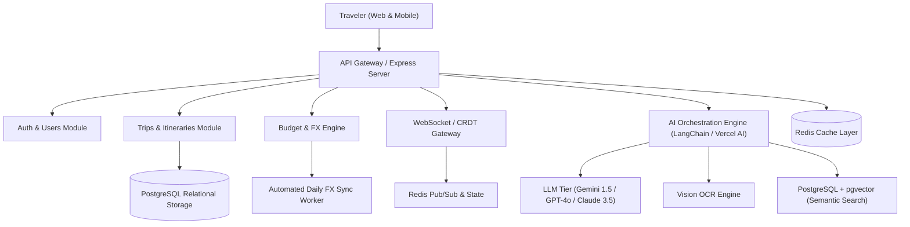

---

## 1. Current Codebase Gap & Scalability Analysis

### 1.1 Database Architecture & Query Bottlenecks

An audit of the current Sequelize relational models (`User`, `Trip`, `TripStop`, `ItineraryDay`, `ItineraryActivityItem`, `TripExpense`, `DestinationCity`, `ActivityCatalog`, `SavedDestination`, `TripShare`, `TripLikeBookmark`) reveals critical areas requiring optimization for high-concurrency production scale:

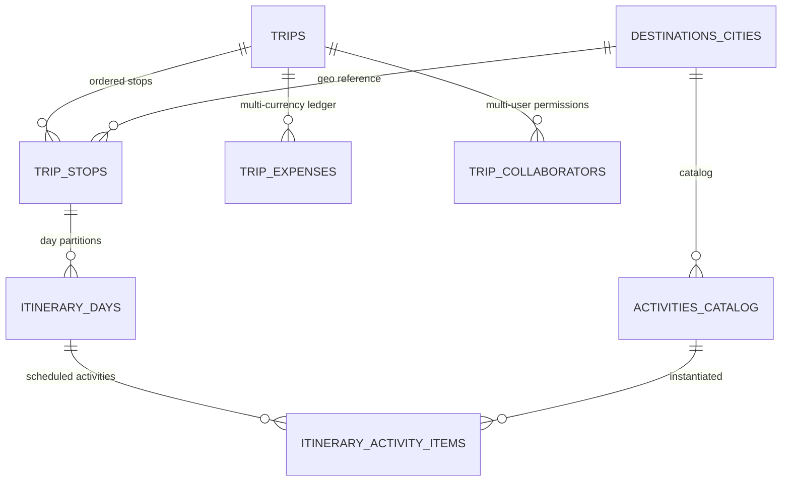

#### Identified Architectural Gaps:
1. **N+1 Deep Itinerary Hydration:**
   - *Problem:* Fetching a full multi-city trip loads `Trip -> TripStop -> ItineraryDay -> ItineraryActivityItem -> ActivityCatalog` in recursive join trees, generating heavy SQL overhead on complex 14-day itineraries.
   - *Remedy:* Implement nested eager loading with projection optimization, or pre-aggregate nested daily snapshots in a denormalized JSONB view or Redis cache.
2. **Missing Composite & Spatial Indexes:**
   - `destinations_cities` lacks PostGIS `GEOGRAPHY(Point, 4326)` columns and GiST spatial indexes, limiting proximity queries (`ST_DWithin`) to compute nearby activities.
   - Need composite indexes on `trip_stops(trip_id, order_index)` and `itinerary_days(trip_stop_id, day_number)`.
3. **Database Concurrency on Collaborative Writes:**
   - Simultaneous activity additions create race conditions on `order_index`. Requires fractional indexing (e.g., Lexorank string ordering) rather than sequential integers to allow conflict-free reordering.

---

### 1.2 Redis Caching Layer Architecture

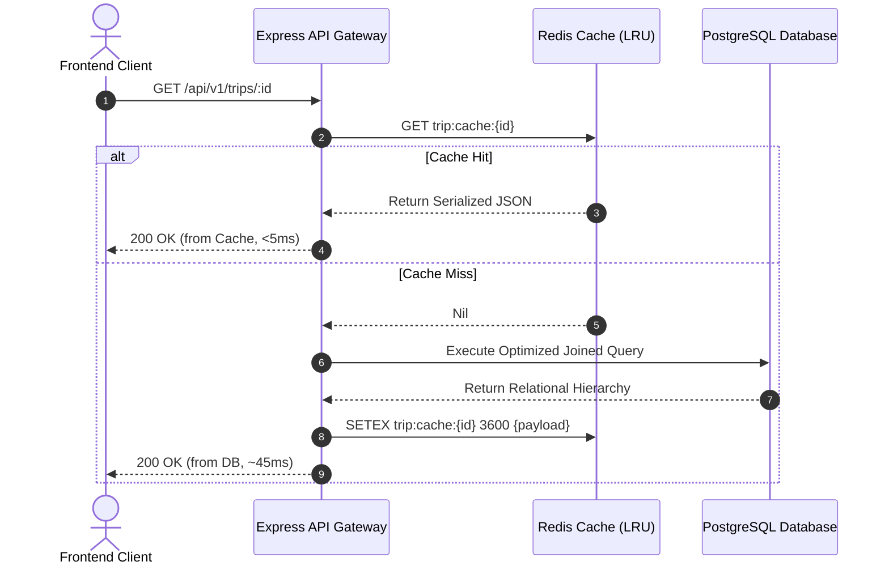

#### Caching Strategy Specifications:
- **Public Itineraries & Catalogs:** Read-heavy entities (`destinations_cities`, `activities_catalog`, public shared community itineraries) cached with **Cache-Aside** strategy (TTL: 24 hours) with invalidation on admin mutation.
- **Trip Hydration Cache:** Key format `trip:{trip_id}:v{version_counter}`. Version counter increments on any stop/day/activity edit, avoiding expensive key deletion sweeps.
- **Session & Rate Limiting:** Centralized distributed token-bucket rate limiter via Redis `INCR` + `EXPIRE` per IP/User to prevent API abuse.

---

### 1.3 Real-Time Multi-User Collaboration (WebSockets & CRDTs)

To transition GlobeTrotter into a Figma-like real-time collaborative trip builder for families and tour groups:

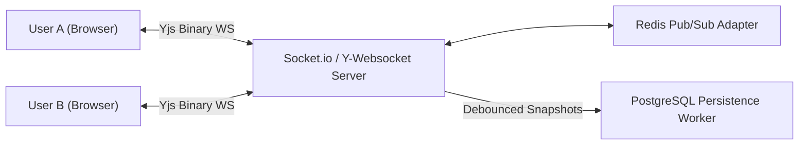

#### Implementation Blueprint:
1. **CRDT Engine:** Utilize **Yjs** (`y-indexeddb` on client for offline-first support, `y-websocket` for synchronization).
2. **Data Structure Representation:**
   - `Y.Array<TripStop>` for drag-and-drop stop reordering.
   - `Y.Map<ItineraryActivityItem>` for live updates to times, notes, and costs.
3. **Awareness & Presence Protocol:**
   - Broadcast live cursor positions, active editing cell, and user avatar badges (`"Marcus is currently editing Day 3 Tokyo dinner"`).
4. **Offline Sync & Reconciliation:**
   - Changes made without internet connectivity persist locally via IndexedDB and automatically rebase and sync upon reconnect without data loss.

---

## 2. Global Usability & Localization Architecture

### 2.1 Multi-Currency Engine & Automated FX Sync

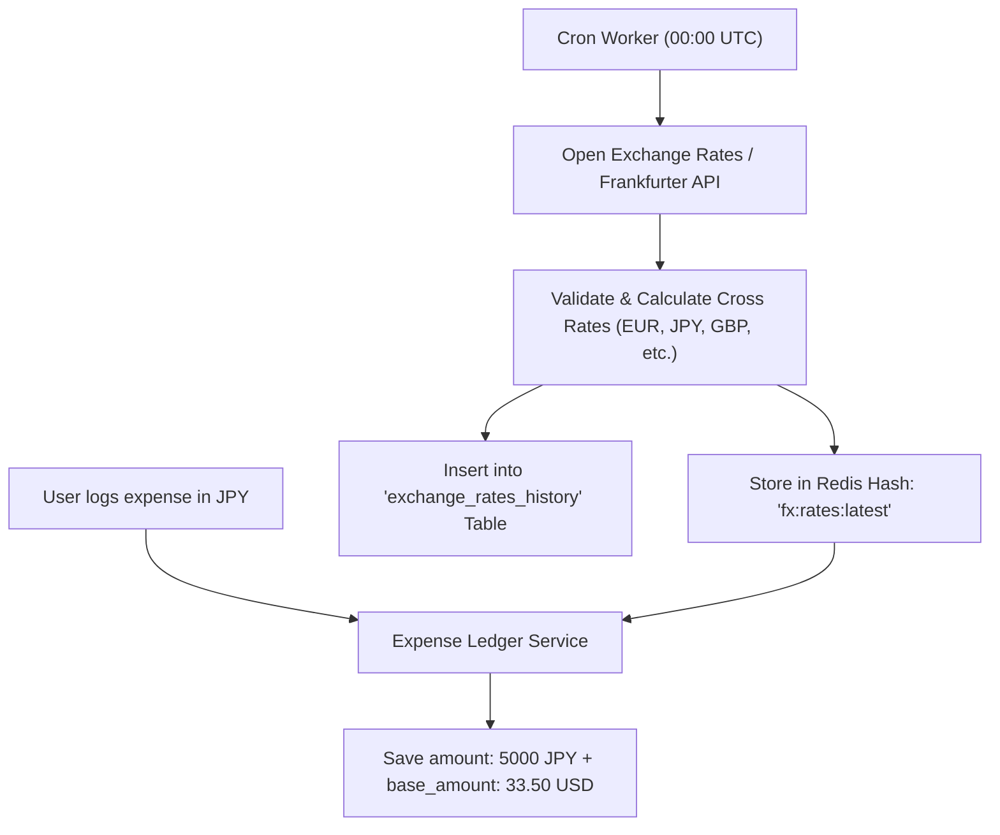

#### Data Schema Extension:
```sql
CREATE TABLE exchange_rates (
    id UUID PRIMARY KEY DEFAULT gen_random_uuid(),
    base_currency VARCHAR(3) NOT NULL DEFAULT 'USD',
    target_currency VARCHAR(3) NOT NULL,
    rate NUMERIC(14, 6) NOT NULL,
    recorded_at TIMESTAMPTZ NOT NULL DEFAULT NOW()
);
CREATE INDEX idx_exchange_rates_lookup ON exchange_rates(base_currency, target_currency, recorded_at DESC);
```

#### Capabilities:
- Automatic conversion of mixed-currency trip expenses (e.g., flight booked in USD, hotel in EUR, meals in JPY) normalized to trip target currency.
- Historical rate tracking for accurate budget audits post-trip.

---

### 2.2 Dynamic Multi-City Timezone Management

Travel across continents and time zones introduces date shifts (e.g., departing SF on Oct 12 and landing in Tokyo on Oct 13).

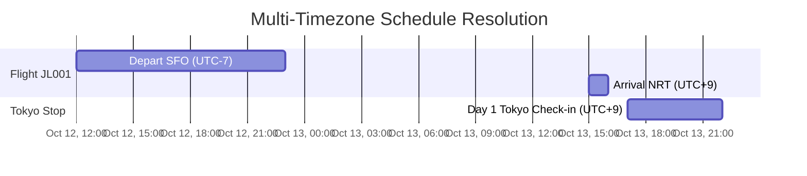

#### Timezone Handling Standards:
1. **Database Representation:** All timestamp fields stored in ISO 8601 UTC (`TIMESTAMPTZ`).
2. **Stop-Level Timezone Binding:** Every `TripStop` stores the exact IANA Timezone identifier (e.g., `Asia/Tokyo`, `Europe/Paris`, `America/New_York`).
3. **Client-Side Resolution:** Frontend utilizes `Intl.DateTimeFormat` or `date-fns-tz` to display activity times in the *destination's local time* rather than the browser's local timezone.

---

### 2.3 Internationalization (i18n) & RTL Layout Roadmap

- **Framework:** `react-i18next` with HTTP backend chunk loading for lightweight language packs.
- **RTL Language Support (Arabic, Hebrew):** CSS logical properties (`margin-inline-start`, `inset-inline-start`) and dynamic `dir="rtl"` attribute injection on root HTML container.
- **Localized Formatting:** Dynamic formatting of currency symbols, numbers, and dates based on traveler locale:
  - `$1,250.00` (en-US) vs `1.250,00 €` (de-DE) vs `￥125,000` (ja-JP).

---

### 2.4 Local Transit & Visa Requirement APIs

- **Visa & Entry Regulation Feeds:** Integration with Sherpa / Timatic API to display passport-specific visa warnings and entry declaration requirements directly in the trip header.
- **Real-Time Transit Feeds:**
  - Flight status via FlightAware / Amadeus API.
  - Rail routing via Navitime API (Japan JR passes) and RailEurope API (Schengen transit).

---

## 3. High-Impact AI & NLP Features for Intelligent Travel Planning

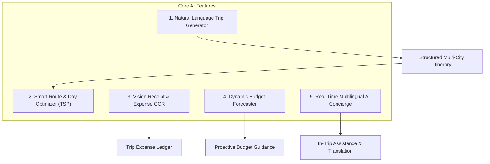

---

### 3.1 Feature 1: Natural Language Trip Generator ("Prompt-to-Itinerary")

#### Concept:
Allows users to enter open-ended natural language prompts (e.g., *"Plan a 9-day romantic foodie trip across Tokyo, Kyoto, and Osaka for 2 adults under $3,500 total, focusing on sushi, historic temples, and scenic walks with moderate walking pace"*).

#### AI Engine Pipeline:

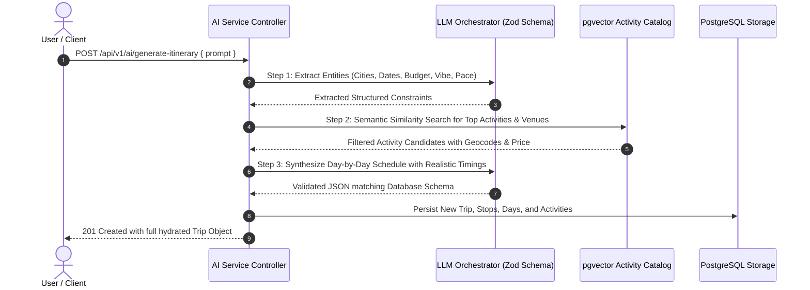

#### JSON Output Specification (Zod Schema):
```typescript
const GeneratedItinerarySchema = z.object({
  tripTitle: z.string(),
  description: z.string(),
  currency: z.string().default('USD'),
  estimatedTotalBudget: z.number(),
  stops: z.array(z.object({
    cityName: z.string(),
    country: z.string(),
    durationDays: z.number(),
    days: z.array(z.object({
      dayNumber: z.number(),
      theme: z.string(),
      activities: z.array(z.object({
        startTime: z.string(), // "09:30 AM"
        endTime: z.string(),   // "11:30 AM"
        title: z.string(),
        subtitle: z.string(),
        category: z.enum(['Food & Drink', 'Sightseeing', 'Adventure', 'Culture', 'Relaxation', 'Shopping', 'Nightlife']),
        estimatedCostUSD: z.number(),
        latitude: z.number(),
        longitude: z.number(),
        description: z.string(),
        localTips: z.string()
      }))
    }))
  }))
});
```

---

### 3.2 Feature 2: Smart Route & Day Schedule Optimizer

#### Concept:
Prevents chaotic travel by solving the **Traveling Salesperson Problem with Time Windows (TSPTW)** for each day's scheduled activities, minimizing transit time and avoiding venues during closed hours.


#### Algorithm Implementation:
- **Heuristic:** Cluster venues by geographic neighborhood (e.g., all Asakusa/Ueno venues in the morning; Shibuya/Shinjuku in the afternoon/evening).
- **Distance Matrix:** Integration with Open Source Routing Machine (OSRM) or Haversine geocode matrix for walk/transit time calculation.
- **Energy / Pace Smoothing:** Inserts automatic 45-minute lunch and rest breaks between strenuous walking tours.

---

### 3.3 Feature 3: Receipt & Invoice Vision OCR Ingestion

#### Concept:
Travelers snap a photo of a restaurant receipt, train ticket, or hotel invoice on their mobile device; the AI vision model parses itemized totals, detects the currency, categorizes the expense, and creates a `TripExpense` entry instantly.

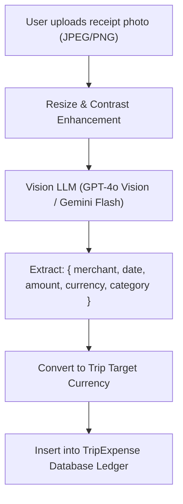

#### Sample Extracted Payload:
```json
{
  "merchantName": "Ichiran Ramen Shinjuku",
  "receiptDate": "2024-10-14T19:34:00Z",
  "originalCurrency": "JPY",
  "originalAmount": 2850,
  "detectedCategory": "MEALS",
  "taxAmount": 285,
  "confidenceScore": 0.98,
  "convertedAmountUSD": 19.10
}
```

---

### 3.4 Feature 4: Dynamic Budget Forecaster & Price Alerting

#### Concept:
Analyzes historical seasonality, local holidays (e.g., Golden Week in Japan, Oktoberfest in Germany), and current flight/lodging pricing trends to predict trip budget requirements and alert travelers when prices are expected to surge.

- **Pre-trip Forecasting:** *"October in Kyoto is peak foliage season; hotel rates average 42% higher than September. We recommend allocating $240/night for accommodations."*
- **In-trip Burn-rate Alerting:** Machine learning linear projection of daily spending to predict whether the traveler will exceed their target budget before the trip ends.

---

### 3.5 Feature 5: Contextual Multilingual AI Travel Concierge

#### Concept:
An in-trip conversational companion embedded within the GlobeTrotter app with full contextual awareness of the user's current day, active stop, booked hotels, and dietary preferences.

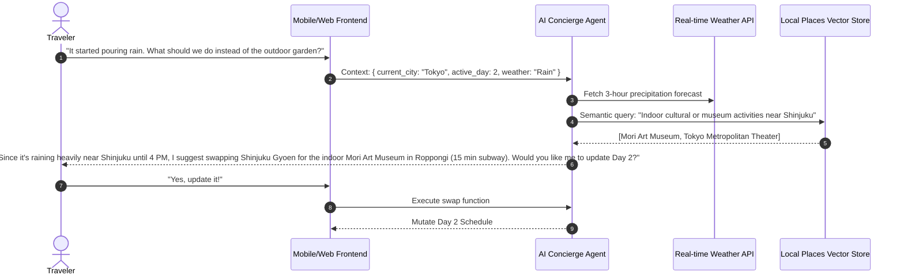

---

## 4. Technical Implementation Blueprint for AI Integration

### 4.1 Orchestration Stack

| Component | Selected Technology | Rationale |
| :--- | :--- | :--- |
| **LLM Provider** | OpenAI (GPT-4o, GPT-4o-mini) & Gemini 1.5 Flash | High token throughput, robust structured JSON output support, vision capabilities. |
| **Orchestration Framework** | **Vercel AI SDK** / **LangChain.js** | Native streaming support, built-in Zod schema enforcement, provider-agnostic flexibility. |
| **Vector Database** | **PostgreSQL + pgvector** extension | Zero additional infrastructure overhead; co-locates relational trip data with semantic activity embeddings. |
| **Embedding Model** | `text-embedding-3-small` (1536 dims) | Ultra-fast indexing, exceptional semantic retrieval at minimal cost ($0.02 / 1M tokens). |
| **Semantic Cache** | Redis Vector Similarity Cache | Caches common travel queries to deliver instantaneous responses with zero LLM inference cost. |

---

### 4.2 Database Schema Enhancements for AI

```sql
-- 1. Enable pgvector extension
CREATE EXTENSION IF NOT EXISTS vector;

-- 2. Add embedding vectors to destinations and activity catalogs
ALTER TABLE destinations_cities 
ADD COLUMN IF NOT EXISTS embedding vector(1536),
ADD COLUMN IF NOT EXISTS timezone_id VARCHAR(50) DEFAULT 'UTC';

ALTER TABLE activities_catalog 
ADD COLUMN IF NOT EXISTS embedding vector(1536),
ADD COLUMN IF NOT EXISTS opening_hours JSONB,
ADD COLUMN IF NOT EXISTS estimated_duration_minutes INT DEFAULT 120;

-- 3. Create HNSW indexes for sub-millisecond similarity search
CREATE INDEX IF NOT EXISTS idx_destinations_embedding 
ON destinations_cities USING hnsw (embedding vector_cosine_ops);

CREATE INDEX IF NOT EXISTS idx_activities_embedding 
ON activities_catalog USING hnsw (embedding vector_cosine_ops);

-- 4. AI Prompt Audit & Session Table
CREATE TABLE ai_generation_logs (
    id UUID PRIMARY KEY DEFAULT gen_random_uuid(),
    user_id UUID REFERENCES users(id) ON DELETE CASCADE,
    prompt_text TEXT NOT NULL,
    generated_trip_id UUID REFERENCES trips(id) ON DELETE SET NULL,
    tokens_used INT NOT NULL,
    model_name VARCHAR(100) NOT NULL,
    latency_ms INT NOT NULL,
    created_at TIMESTAMPTZ DEFAULT NOW()
);
```

---

### 4.3 Concrete REST API Specifications for AI Services

#### 1. `POST /api/v1/ai/generate-itinerary`
- **Description:** Generates a structured multi-day itinerary from natural language.
- **Request Body:**
  ```json
  {
    "prompt": "7 days in Italy visiting Rome and Florence for 2 adults with a $2500 budget focused on art and food",
    "preferredLanguage": "en",
    "preferredCurrency": "USD"
  }
  ```
- **Response (201 Created):** Returns the fully constructed and persisted `Trip` record with all associated `TripStops`, `ItineraryDays`, and `ItineraryActivityItems`.

#### 2. `POST /api/v1/ai/optimize-schedule`
- **Description:** Reorders a day's activities to minimize travel distance.
- **Request Body:**
  ```json
  {
    "itineraryDayId": "8f3b2c1a-5d6e-4a7b-8c9d-0e1f2a3b4c5d",
    "transportMode": "transit" // "walking" | "driving" | "transit"
  }
  ```
- **Response (200 OK):**
  ```json
  {
    "optimizedOrder": ["activity_uuid_3", "activity_uuid_1", "activity_uuid_2"],
    "totalTransitTimeMinutes": 38,
    "transitTimeSavedMinutes": 45
  }
  ```

#### 3. `POST /api/v1/ai/parse-receipt`
- **Description:** Multi-part form upload for receipt OCR.
- **Request:** Form data with `image` file and `tripId`.
- **Response (200 OK):** Itemized ledger entry ready for single-click confirmation.

#### 4. `POST /api/v1/ai/chat` (Streaming SSE)
- **Description:** Real-time streaming conversational concierge for in-trip assistance.

---

### 4.4 Cost Control, Token Caching & Fallback Strategy

```mermaid
flowchart TD
    UserPrompt["User Prompt Ingestion"] --> CheckRedisHash["Compute SHA256 of Prompt"]
    CheckRedisHash --> RedisExactMatch{Exact Cache Hit?}
    RedisExactMatch -- Yes --> ReturnCachedResponse["Return Cached Response (<10ms, $0.00)"]
    RedisExactMatch -- No --> SemanticSearchVector{Similar Prompt in Vector Cache? (Cosine > 0.95)}
    SemanticSearchVector -- Yes --> ReturnAdapted["Return Adapted Cached Result (<50ms)"]
    SemanticSearchVector -- No --> CheckRateLimits["Validate User AI Quota (e.g. 20 generations/day)"]
    CheckRateLimits --> CallFastLLM["Call Fast Model (Gemini 1.5 Flash / GPT-4o-mini)"]
    CallFastLLM --> ValidateJSON{Valid Schema?}
    ValidateJSON -- Yes --> CacheAndReturn["Cache in Redis + Return Response"]
    ValidateJSON -- No --> FallbackHeavyModel["Fallback to GPT-4o / Claude 3.5 Sonnet"]
    FallbackHeavyModel --> CacheAndReturn
```

---

## 5. Phased Rollout Strategy

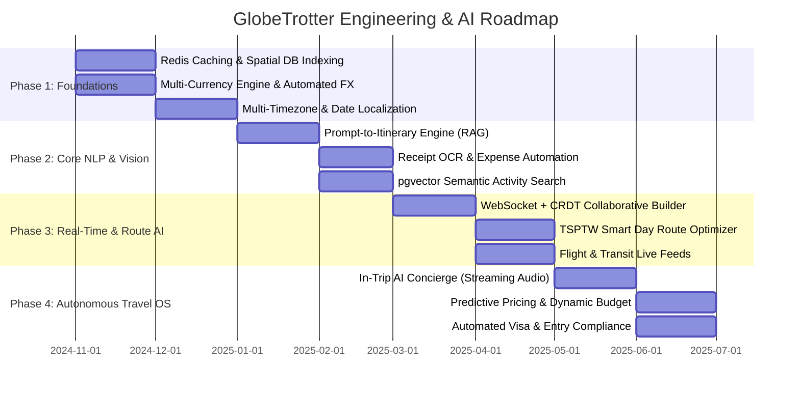

### Phase 1: High-Performance Infrastructure & Global Foundations (Months 1–2)
- Deploy Redis caching layers for high-throughput public itineraries.
- Add spatial PostGIS indexing to `destinations_cities`.
- Launch multi-currency engine with automated daily exchange rate workers.
- Standardize ISO-8601 UTC and IANA destination timezone bindings across all screens.

### Phase 2: Core NLP Trip Generation & Vision OCR (Months 3–4)
- Implement `POST /api/v1/ai/generate-itinerary` using Vercel AI SDK + Zod structured schema outputs.
- Ingest `pgvector` embeddings for all destinations and activities in the catalog.
- Launch Vision Receipt Parser to populate `TripExpense` with zero manual typing.

### Phase 3: Real-Time Collaboration & Route Optimization (Months 5–6)
- Integrate Yjs CRDTs over WebSockets for multi-user shared itinerary editing with live presence.
- Deploy Day Route Optimizer (TSPTW) to minimize transit times.
- Hook into Amadeus and Navitime live transit feeds.

### Phase 4: Autonomous Travel Concierge & Predictive Analytics (Months 7–8)
- Deploy context-aware streaming AI Concierge for in-trip weather pivots and language translation.
- Introduce dynamic price forecasting and season surge alerts.
- Expand internationalization (i18n) with full RTL Arabic/Hebrew support.

---

## 6. Summary Architecture Matrix

| Capability | Current State | Target Architecture | Key Technology |
| :--- | :--- | :--- | :--- |
| **Itinerary Generation** | Manual form entry & drag-and-drop | Natural language prompt-to-trip | OpenAI GPT-4o / Gemini 1.5 + Zod schemas |
| **Search & Discovery** | Exact string matching / filter pills | Hybrid Semantic Vector + Keyword Search | PostgreSQL `pgvector` + HNSW cosine index |
| **Route Planning** | User-arranged sequential stops | Automated TSPTW routing with open-hours verification | 2-Opt TSP Algorithm + OSRM Distance Matrix |
| **Expense Recording** | Manual form entry | Instant photo OCR + currency auto-conversion | Vision LLM + Open Exchange Rates worker |
| **Collaboration** | Single-user read/write | Multi-user live editing with presence indicators | Yjs CRDTs + Socket.io + Redis Pub/Sub |
| **Currency & Time** | Static strings (`$`, `USD`) | Multi-currency ledger & IANA timezone offsets | Automated FX Sync Cron + `date-fns-tz` |

---

*Authored by the GlobeTrotter Systems Architecture & AI Engineering Team.*
