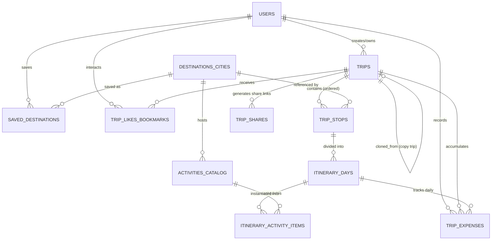
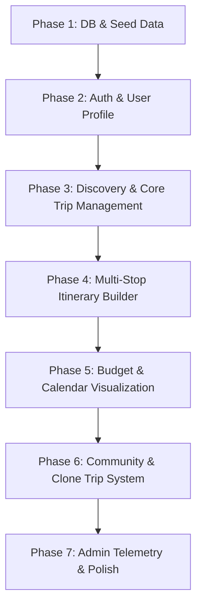

# GlobeTrotter — Complete System Architecture & Implementation Blueprint

---

## Executive Summary & Vision

**GlobeTrotter** is a personalized, intelligent, and collaborative multi-city travel planning platform. It allows users to build day-wise multi-city itineraries, discover destinations and activities, track categorized budgets with visual analytics, visualize schedules across interactive timelines/calendars, and share or clone community trips.

This document serves as the comprehensive engineering specification and step-by-step implementation blueprint, designed around the 12 wireframe screens and product requirements.

---

## Step 1: Relational Data Model & Schema Design



---

### Core Entities & Field Specifications

#### 1. `users`
Stores user credentials, profile attributes, regional preferences, and account status.
* **`id`**: `UUID` (Primary Key, default `gen_random_uuid()`)
* **`email`**: `VARCHAR(255)` (Unique, Not Null, Indexed)
* **`password_hash`**: `VARCHAR(255)` (Not Null)
* **`first_name`**: `VARCHAR(100)` (Not Null)
* **`last_name`**: `VARCHAR(100)` (Not Null)
* **`phone_number`**: `VARCHAR(30)` (Nullable)
* **`city`**: `VARCHAR(100)` (Nullable)
* **`country`**: `VARCHAR(100)` (Nullable)
* **`bio`**: `TEXT` (Nullable)
* **`avatar_url`**: `TEXT` (Nullable)
* **`role`**: `ENUM('TRAVELER', 'ADMIN')` (Default: `'TRAVELER'`)
* **`preferred_language`**: `VARCHAR(10)` (Default: `'en'`)
* **`preferred_currency`**: `VARCHAR(3)` (Default: `'USD'`)
* **`is_active`**: `BOOLEAN` (Default: `true`)
* **`created_at`**: `TIMESTAMPTZ` (Default: `NOW()`)
* **`updated_at`**: `TIMESTAMPTZ` (Default: `NOW()`)

---

#### 2. `trips`
Represents the top-level container for a travel itinerary.
* **`id`**: `UUID` (Primary Key)
* **`user_id`**: `UUID` (Foreign Key -> `users.id` ON DELETE CASCADE, Indexed)
* **`title`**: `VARCHAR(200)` (Not Null)
* **`description`**: `TEXT` (Nullable)
* **`cover_image_url`**: `TEXT` (Nullable)
* **`start_date`**: `DATE` (Not Null, Indexed)
* **`end_date`**: `DATE` (Not Null, Indexed)
* **`total_budget`**: `DECIMAL(12, 2)` (Default: `0.00`)
* **`currency`**: `VARCHAR(3)` (Default: `'USD'`)
* **`status`**: `ENUM('PLANNING', 'ONGOING', 'COMPLETED', 'CANCELLED')` (Default: `'PLANNING'`, Indexed)
* **`visibility`**: `ENUM('PRIVATE', 'PUBLIC', 'SHARED_LINK')` (Default: `'PRIVATE'`, Indexed)
* **`copied_from_trip_id`**: `UUID` (Foreign Key -> `trips.id` ON DELETE SET NULL, Nullable, Indexed)
* **`clone_count`**: `INTEGER` (Default: `0`)
* **`view_count`**: `INTEGER` (Default: `0`)
* **`created_at`**: `TIMESTAMPTZ` (Default: `NOW()`)
* **`updated_at`**: `TIMESTAMPTZ` (Default: `NOW()`)

*Constraint:* `CHECK (end_date >= start_date)`

---

#### 3. `destinations_cities`
Global catalog of searchable destinations with metadata, cost indices, and coordinates.
* **`id`**: `UUID` (Primary Key)
* **`name`**: `VARCHAR(150)` (Not Null, Indexed)
* **`state_region`**: `VARCHAR(150)` (Nullable)
* **`country`**: `VARCHAR(100)` (Not Null, Indexed)
* **`country_code`**: `VARCHAR(2)` (Not Null, Indexed)
* **`latitude`**: `DECIMAL(10, 7)` (Not Null)
* **`longitude`**: `DECIMAL(10, 7)` (Not Null)
* **`cost_index`**: `ENUM('BUDGET', 'MODERATE', 'LUXURY')` (Default: `'MODERATE'`)
* **`popularity_score`**: `INTEGER` (Default: `0`, Indexed)
* **`cover_image_url`**: `TEXT` (Not Null)
* **`description`**: `TEXT` (Nullable)
* **`created_at`**: `TIMESTAMPTZ` (Default: `NOW()`)

---

#### 4. `trip_stops` (Multi-City Sections)
Represents a specific city stop in a multi-destination trip.
* **`id`**: `UUID` (Primary Key)
* **`trip_id`**: `UUID` (Foreign Key -> `trips.id` ON DELETE CASCADE, Indexed)
* **`city_id`**: `UUID` (Foreign Key -> `destinations_cities.id` ON DELETE RESTRICT, Indexed)
* **`stop_order`**: `INTEGER` (Not Null)
* **`arrival_date`**: `DATE` (Not Null)
* **`departure_date`**: `DATE` (Not Null)
* **`allocated_budget`**: `DECIMAL(12, 2)` (Default: `0.00`)
* **`notes`**: `TEXT` (Nullable)
* **`created_at`**: `TIMESTAMPTZ` (Default: `NOW()`)
* **`updated_at`**: `TIMESTAMPTZ` (Default: `NOW()`)

*Constraints:* 
* `UNIQUE (trip_id, stop_order)`
* `CHECK (departure_date >= arrival_date)`

---

#### 5. `itinerary_days`
Represents an individual day within a specific trip stop.
* **`id`**: `UUID` (Primary Key)
* **`trip_stop_id`**: `UUID` (Foreign Key -> `trip_stops.id` ON DELETE CASCADE, Indexed)
* **`day_number`**: `INTEGER` (Not Null)
* **`date`**: `DATE` (Not Null, Indexed)
* **`notes`**: `TEXT` (Nullable)
* **`daily_budget_min`**: `DECIMAL(10, 2)` (Default: `0.00`)
* **`daily_budget_max`**: `DECIMAL(10, 2)` (Default: `0.00`)
* **`created_at`**: `TIMESTAMPTZ` (Default: `NOW()`)

*Constraint:* `UNIQUE (trip_stop_id, day_number)`

---

#### 6. `activities_catalog`
Curated global activity discovery pool with costs, durations, and categorization.
* **`id`**: `UUID` (Primary Key)
* **`city_id`**: `UUID` (Foreign Key -> `destinations_cities.id` ON DELETE CASCADE, Indexed)
* **`title`**: `VARCHAR(200)` (Not Null, Indexed)
* **`description`**: `TEXT` (Nullable)
* **`category`**: `ENUM('SIGHTSEEING', 'FOOD_AND_DRINK', 'ADVENTURE', 'CULTURE', 'RELAXATION', 'SHOPPING', 'NIGHTLIFE')` (Not Null, Indexed)
* **`estimated_duration_mins`**: `INTEGER` (Default: `60`)
* **`estimated_cost`**: `DECIMAL(10, 2)` (Default: `0.00`, Indexed)
* **`currency`**: `VARCHAR(3)` (Default: `'USD'`)
* **`address`**: `TEXT` (Nullable)
* **`latitude`**: `DECIMAL(10, 7)` (Nullable)
* **`longitude`**: `DECIMAL(10, 7)` (Nullable)
* **`image_url`**: `TEXT` (Nullable)
* **`rating`**: `DECIMAL(3, 2)` (Default: `5.00`)
* **`is_verified`**: `BOOLEAN` (Default: `true`)
* **`created_at`**: `TIMESTAMPTZ` (Default: `NOW()`)

---

#### 7. `itinerary_activity_items`
Scheduled activity instances inside a specific itinerary day.
* **`id`**: `UUID` (Primary Key)
* **`itinerary_day_id`**: `UUID` (Foreign Key -> `itinerary_days.id` ON DELETE CASCADE, Indexed)
* **`activity_catalog_id`**: `UUID` (Foreign Key -> `activities_catalog.id` ON DELETE SET NULL, Nullable, Indexed)
* **`custom_title`**: `VARCHAR(200)` (Not Null)
* **`custom_description`**: `TEXT` (Nullable)
* **`category`**: `VARCHAR(50)` (Default: `'SIGHTSEEING'`)
* **`start_time`**: `TIME` (Nullable)
* **`end_time`**: `TIME` (Nullable)
* **`cost`**: `DECIMAL(10, 2)` (Default: `0.00`)
* **`currency`**: `VARCHAR(3)` (Default: `'USD'`)
* **`expense_category`**: `ENUM('TRANSPORT', 'STAY', 'ACTIVITIES', 'MEALS', 'MISC')` (Default: `'ACTIVITIES'`)
* **`is_completed`**: `BOOLEAN` (Default: `false`)
* **`item_order`**: `INTEGER` (Not Null)
* **`created_at`**: `TIMESTAMPTZ` (Default: `NOW()`)
* **`updated_at`**: `TIMESTAMPTZ` (Default: `NOW()`)

---

#### 8. `trip_expenses`
Granular financial ledger entries for budget breakdown and over-budget alerting.
* **`id`**: `UUID` (Primary Key)
* **`trip_id`**: `UUID` (Foreign Key -> `trips.id` ON DELETE CASCADE, Indexed)
* **`trip_stop_id`**: `UUID` (Foreign Key -> `trip_stops.id` ON DELETE SET NULL, Nullable)
* **`itinerary_day_id`**: `UUID` (Foreign Key -> `itinerary_days.id` ON DELETE SET NULL, Nullable)
* **`activity_item_id`**: `UUID` (Foreign Key -> `itinerary_activity_items.id` ON DELETE SET NULL, Nullable)
* **`category`**: `ENUM('TRANSPORT', 'STAY', 'ACTIVITIES', 'MEALS', 'MISC')` (Not Null, Indexed)
* **`title`**: `VARCHAR(200)` (Not Null)
* **`amount`**: `DECIMAL(10, 2)` (Not Null)
* **`currency`**: `VARCHAR(3)` (Default: `'USD'`)
* **`expense_date`**: `DATE` (Not Null, Indexed)
* **`receipt_url`**: `TEXT` (Nullable)
* **`created_at`**: `TIMESTAMPTZ` (Default: `NOW()`)

---

#### 9. `saved_destinations`
User wishlists / preferred destinations (N:M relation).
* **`id`**: `UUID` (Primary Key)
* **`user_id`**: `UUID` (Foreign Key -> `users.id` ON DELETE CASCADE, Indexed)
* **`city_id`**: `UUID` (Foreign Key -> `destinations_cities.id` ON DELETE CASCADE, Indexed)
* **`notes`**: `VARCHAR(255)` (Nullable)
* **`created_at`**: `TIMESTAMPTZ` (Default: `NOW()`)

*Constraint:* `UNIQUE (user_id, city_id)`

---

#### 10. `trip_shares` & `trip_likes_bookmarks`
Sharing tokens and social interactions.
* **`trip_shares`**: `id (UUID)`, `trip_id (UUID FK)`, `share_token (VARCHAR(64) UNIQUE)`, `permission (ENUM('VIEW', 'EDIT'))`, `expires_at (TIMESTAMPTZ NULL)`
* **`trip_likes_bookmarks`**: `id (UUID)`, `user_id (UUID FK)`, `trip_id (UUID FK)`, `is_liked (BOOLEAN)`, `is_bookmarked (BOOLEAN)`, `created_at (TIMESTAMPTZ)` -> `UNIQUE (user_id, trip_id)`

---

## Step 2: Layer-by-Layer API Routes & Endpoints Specifications

All API routes follow a standardized REST envelope format:

```json
{
  "success": true,
  "statusCode": 200,
  "message": "Operation completed successfully",
  "data": {},
  "meta": { "page": 1, "limit": 20, "total": 100 }
}
```

```json
{
  "success": false,
  "statusCode": 400,
  "error": "BAD_REQUEST",
  "message": "Validation failed",
  "details": [{ "field": "startDate", "issue": "start_date must be before end_date" }]
}
```

---

### Layer 1: Auth & Identity Management Layer

| Method | Path | Auth / Role | Request Payload / Params | Response Payload Summary |
| :--- | :--- | :--- | :--- | :--- |
| `POST` | `/api/v1/auth/register` | Public | `{ firstName, lastName, email, password, phone, city, country, bio }` | `201 Created` -> `{ user: UserProfile, token: string }` |
| `POST` | `/api/v1/auth/login` | Public | `{ email, password }` | `200 OK` -> `{ user: UserProfile, token: string, refreshToken: string }` |
| `POST` | `/api/v1/auth/refresh` | Public | `{ refreshToken }` | `200 OK` -> `{ token: string }` |
| `POST` | `/api/v1/auth/forgot-password` | Public | `{ email }` | `200 OK` -> `{ message: "Password reset link sent" }` |
| `POST` | `/api/v1/auth/reset-password` | Public | `{ token, newPassword }` | `200 OK` -> `{ message: "Password updated successfully" }` |
| `GET` | `/api/v1/users/me` | Authenticated | *None* | `200 OK` -> `{ user: UserProfile, preferences: {} }` |
| `PATCH` | `/api/v1/users/me` | Authenticated | `{ firstName?, lastName?, phone?, city?, country?, bio?, avatarUrl?, preferredCurrency?, preferredLanguage? }` | `200 OK` -> `{ user: UpdatedUserProfile }` |
| `DELETE` | `/api/v1/users/me` | Authenticated | `{ confirmation: "DELETE" }` | `200 OK` -> `{ message: "Account deleted" }` |
| `GET` | `/api/v1/users/me/saved-destinations` | Authenticated | `?page=1&limit=20` | `200 OK` -> `{ items: DestinationCity[] }` |
| `POST` | `/api/v1/users/me/saved-destinations` | Authenticated | `{ cityId, notes? }` | `201 Created` -> `{ id, cityId, savedAt }` |
| `DELETE` | `/api/v1/users/me/saved-destinations/:cityId` | Authenticated | *None* | `200 OK` -> `{ message: "City removed from saved list" }` |

---

### Layer 2: Trip & Multi-City Itinerary Layer

| Method | Path | Auth / Role | Request Payload / Params | Response Payload Summary |
| :--- | :--- | :--- | :--- | :--- |
| `GET` | `/api/v1/trips` | Authenticated | `?status=PLANNING\|ONGOING\|COMPLETED&page=1&limit=10` | `200 OK` -> `{ items: TripSummaryCard[], counts: { ongoing, upcoming, completed } }` |
| `POST` | `/api/v1/trips` | Authenticated | `{ title, description?, startDate, endDate, totalBudget?, currency?, coverImageUrl?, initialCityIds?: string[] }` | `201 Created` -> `{ trip: FullTripRecord }` |
| `GET` | `/api/v1/trips/:tripId` | Authenticated / Owner | *None* | `200 OK` -> `{ trip: FullTripWithStopsAndDays }` |
| `PATCH` | `/api/v1/trips/:tripId` | Authenticated / Owner | `{ title?, description?, startDate?, endDate?, totalBudget?, status?, visibility?, coverImageUrl? }` | `200 OK` -> `{ trip: UpdatedTrip }` |
| `DELETE` | `/api/v1/trips/:tripId` | Authenticated / Owner | *None* | `200 OK` -> `{ message: "Trip deleted successfully" }` |
| `POST` | `/api/v1/trips/:tripId/stops` | Authenticated / Owner | `{ cityId, arrivalDate, departureDate, allocatedBudget?, notes? }` | `201 Created` -> `{ stop: TripStopWithGeneratedDays }` |
| `PATCH` | `/api/v1/trips/:tripId/stops/reorder` | Authenticated / Owner | `{ stopOrder: [{ stopId: string, newOrder: number }] }` | `200 OK` -> `{ stops: TripStop[] }` |
| `PATCH` | `/api/v1/trips/:tripId/stops/:stopId` | Authenticated / Owner | `{ arrivalDate?, departureDate?, allocatedBudget?, notes? }` | `200 OK` -> `{ stop: UpdatedTripStop }` |
| `DELETE` | `/api/v1/trips/:tripId/stops/:stopId` | Authenticated / Owner | *None* | `200 OK` -> `{ message: "Stop removed and days reconciled" }` |
| `POST` | `/api/v1/trips/days/:dayId/items` | Authenticated / Owner | `{ activityCatalogId?, customTitle, customDescription?, category?, startTime?, endTime?, cost?, currency?, expenseCategory? }` | `201 Created` -> `{ item: ItineraryActivityItem }` |
| `PATCH` | `/api/v1/trips/items/:itemId` | Authenticated / Owner | `{ customTitle?, startTime?, endTime?, cost?, isCompleted?, itemOrder?, expenseCategory? }` | `200 OK` -> `{ item: UpdatedActivityItem }` |
| `DELETE` | `/api/v1/trips/items/:itemId` | Authenticated / Owner | *None* | `200 OK` -> `{ message: "Activity item deleted" }` |

---

### Layer 3: Activity, City Discovery & Search Layer

| Method | Path | Auth / Role | Request Payload / Params | Response Payload Summary |
| :--- | :--- | :--- | :--- | :--- |
| `GET` | `/api/v1/cities/search` | Public / Auth | `?q=Paris&country=&costIndex=BUDGET&page=1&limit=20` | `200 OK` -> `{ items: DestinationCity[], total: number }` |
| `GET` | `/api/v1/cities/popular` | Public / Auth | `?limit=8` | `200 OK` -> `{ items: DestinationCity[] }` |
| `GET` | `/api/v1/cities/:cityId` | Public / Auth | *None* | `200 OK` -> `{ city: DestinationCityDetails, topActivities: Activity[] }` |
| `GET` | `/api/v1/activities/search` | Public / Auth | `?q=&cityId=&category=&maxCost=&maxDuration=&page=1&limit=20` | `200 OK` -> `{ items: ActivityCatalogItem[] }` |
| `GET` | `/api/v1/cities/:cityId/suggestions` | Public / Auth | `?pattern=adventure\|culture` | `200 OK` -> `{ suggestedActivities: ActivityCatalogItem[] }` |

---

### Layer 4: Budget & Financial Analytics Layer

| Method | Path | Auth / Role | Request Payload / Params | Response Payload Summary |
| :--- | :--- | :--- | :--- | :--- |
| `GET` | `/api/v1/trips/:tripId/budget/summary` | Authenticated / Viewer | *None* | `200 OK` -> `{ totalBudget, totalSpent, remainingBudget, averageDailyCost, categoryBreakdown: { transport: 0, stay: 0, activities: 0, meals: 0, misc: 0 }, overBudgetDays: [{ dayId, date, allocated, actual, variance }] }` |
| `GET` | `/api/v1/trips/:tripId/expenses` | Authenticated / Viewer | `?category=&startDate=&endDate=` | `200 OK` -> `{ items: TripExpense[] }` |
| `POST` | `/api/v1/trips/:tripId/expenses` | Authenticated / Owner | `{ category, title, amount, currency, expenseDate, tripStopId?, itineraryDayId?, activityItemId?, receiptUrl? }` | `201 Created` -> `{ expense: TripExpense }` |
| `DELETE` | `/api/v1/trips/:tripId/expenses/:expenseId` | Authenticated / Owner | *None* | `200 OK` -> `{ message: "Expense entry deleted" }` |

---

### Layer 5: Timeline & Calendar Scheduling Layer

| Method | Path | Auth / Role | Request Payload / Params | Response Payload Summary |
| :--- | :--- | :--- | :--- | :--- |
| `GET` | `/api/v1/trips/:tripId/timeline` | Authenticated / Viewer | *None* | `200 OK` -> `{ days: [{ date, dayNumber, cityName, activities: [...] }] }` |
| `GET` | `/api/v1/calendar/my-trips` | Authenticated | `?startMonth=2026-01&endMonth=2026-12` | `200 OK` -> `{ events: [{ tripId, title, startDate, endDate, stops: [{ cityName, start, end, color }] }] }` |
| `PATCH` | `/api/v1/trips/items/reschedule` | Authenticated / Owner | `{ itemId, targetDayId, targetStartTime, targetEndTime, newOrder }` | `200 OK` -> `{ success: true, updatedItem: ItineraryActivityItem }` |

---

### Layer 6: Community, Social & Sharing Layer

| Method | Path | Auth / Role | Request Payload / Params | Response Payload Summary |
| :--- | :--- | :--- | :--- | :--- |
| `GET` | `/api/v1/community/feed` | Public / Auth | `?search=&tag=&sort=popular\|recent&page=1&limit=15` | `200 OK` -> `{ items: PublicTripCard[] }` |
| `GET` | `/api/v1/community/trips/:tripId` | Public / Auth | *None* | `200 OK` -> `{ trip: PublicTripDetail, author: PublicProfile, isLiked: bool }` |
| `POST` | `/api/v1/trips/:tripId/share-link` | Authenticated / Owner | `{ permission: 'VIEW' }` | `200 OK` -> `{ shareUrl: string, shareToken: string }` |
| `GET` | `/api/v1/shared/trips/:shareToken` | Public | *None* | `200 OK` -> `{ trip: FullTripReadOnlyView }` |
| `POST` | `/api/v1/trips/:tripId/copy` | Authenticated | `{ newStartDate?: string }` | `201 Created` -> `{ clonedTripId: string, message: "Trip copied to your account" }` |
| `POST` | `/api/v1/trips/:tripId/like` | Authenticated | *None* | `200 OK` -> `{ isLiked: boolean, likeCount: number }` |

---

### Layer 7: Admin & Platform Analytics Layer

| Method | Path | Auth / Role | Request Payload / Params | Response Payload Summary |
| :--- | :--- | :--- | :--- | :--- |
| `GET` | `/api/v1/admin/analytics/overview` | Admin Only | `?timeframe=30d\|90d\|1y` | `200 OK` -> `{ totalUsers, activeTrips, totalTripsCreated, totalDestinationsSaved, revenueEstimate }` |
| `GET` | `/api/v1/admin/analytics/trends` | Admin Only | *None* | `200 OK` -> `{ topCities: [{ city, count }], topActivities: [{ activity, count }], tripsCreatedTimeSeries: [...] }` |
| `GET` | `/api/v1/admin/users` | Admin Only | `?search=&role=&page=1&limit=25` | `200 OK` -> `{ items: AdminUserRow[], total: number }` |
| `PATCH` | `/api/v1/admin/users/:userId/status` | Admin Only | `{ isActive: boolean }` | `200 OK` -> `{ userId, isActive }` |

---

## Step 3: Complete Project File Tree & Architecture

Below is a modular full-stack monorepo architecture separating the backend API, frontend web application, and shared types.

```
globetrotter/
├── package.json
├── turbo.json (or workspace config)
├── .env.example
├── .gitignore
│
├── packages/
│   └── types/                                # Shared TypeScript interfaces & DTOs
│       ├── package.json
│       ├── src/
│       │   ├── auth.types.ts
│       │   ├── trip.types.ts
│       │   ├── itinerary.types.ts
│       │   ├── budget.types.ts
│       │   ├── city.types.ts
│       │   ├── community.types.ts
│       │   └── index.ts
│
├── apps/
│   ├── api/                                  # Backend Service (Node/Express/Nest/Fastify)
│   │   ├── package.json
│   │   ├── tsconfig.json
│   │   ├── src/
│   │   │   ├── config/
│   │   │   │   ├── database.ts               # Database connection pool & ORM client
│   │   │   │   ├── env.ts                    # Env variable schema validation
│   │   │   │   └── security.ts               # JWT, CORS, rate limiter config
│   │   │   ├── database/
│   │   │   │   ├── migrations/               # Schema DDL migration files
│   │   │   │   │   ├── 001_create_users.sql
│   │   │   │   │   ├── 002_create_destinations_and_activities.sql
│   │   │   │   │   ├── 003_create_trips_and_stops.sql
│   │   │   │   │   ├── 004_create_itineraries_and_items.sql
│   │   │   │   │   └── 005_create_budgets_and_social.sql
│   │   │   │   └── seeders/                  # Mock cities, activities, and demo trips
│   │   │   │       ├── 01_cities_seeder.ts
│   │   │   │       └── 02_activities_seeder.ts
│   │   │   ├── middleware/
│   │   │   │   ├── auth.middleware.ts        # JWT verification & claims decoding
│   │   │   │   ├── role.middleware.ts        # Admin authorization guard
│   │   │   │   ├── validate.middleware.ts    # Request schema validator (Zod/Joi)
│   │   │   │   └── error.middleware.ts       # Global error & exception handler
│   │   │   ├── modules/
│   │   │   │   ├── auth/
│   │   │   │   │   ├── auth.controller.ts
│   │   │   │   │   ├── auth.service.ts
│   │   │   │   │   ├── auth.routes.ts
│   │   │   │   │   └── auth.dto.ts
│   │   │   │   ├── users/
│   │   │   │   │   ├── user.controller.ts
│   │   │   │   │   ├── user.service.ts
│   │   │   │   │   ├── user.routes.ts
│   │   │   │   │   └── user.repository.ts
│   │   │   │   ├── trips/
│   │   │   │   │   ├── trip.controller.ts
│   │   │   │   │   ├── trip.service.ts
│   │   │   │   │   ├── trip.routes.ts
│   │   │   │   │   └── trip.repository.ts
│   │   │   │   ├── itinerary/
│   │   │   │   │   ├── itinerary.controller.ts
│   │   │   │   │   ├── itinerary.service.ts
│   │   │   │   │   ├── itinerary.routes.ts
│   │   │   │   │   └── itinerary.repository.ts
│   │   │   │   ├── discovery/
│   │   │   │   │   ├── discovery.controller.ts
│   │   │   │   │   ├── discovery.service.ts
│   │   │   │   │   ├── discovery.routes.ts
│   │   │   │   │   └── discovery.repository.ts
│   │   │   │   ├── budget/
│   │   │   │   │   ├── budget.controller.ts
│   │   │   │   │   ├── budget.service.ts
│   │   │   │   │   ├── budget.routes.ts
│   │   │   │   │   └── budget.calculator.ts  # Variance & category aggregate logic
│   │   │   │   ├── community/
│   │   │   │   │   ├── community.controller.ts
│   │   │   │   │   ├── community.service.ts
│   │   │   │   │   ├── community.routes.ts
│   │   │   │   │   └── clone-trip.service.ts # Deep-clone logic for copied itineraries
│   │   │   │   └── admin/
│   │   │   │       ├── admin.controller.ts
│   │   │   │       ├── admin.service.ts
│   │   │   │       └── admin.routes.ts
│   │   │   ├── utils/
│   │   │   │   ├── date-helpers.ts
│   │   │   │   └── api-response.ts
│   │   │   └── server.ts
│   │
│   └── web/                                  # Frontend Single Page / SSR App
│       ├── package.json
│       ├── tsconfig.json
│       ├── index.html
│       ├── src/
│       │   ├── assets/
│       │   │   ├── images/
│       │   │   └── icons/
│       │   ├── styles/
│       │   │   ├── index.css                 # Global styles, variables, typography
│       │   │   ├── tokens.css                # Color palettes, radius, spacing tokens
│       │   │   └── animations.css            # Micro-interactions, transitions
│       │   ├── components/
│       │   │   ├── common/                   # Reusable atomic UI elements
│       │   │   │   ├── Navbar.tsx
│       │   │   │   ├── Footer.tsx
│       │   │   │   ├── Button.tsx
│       │   │   │   ├── Input.tsx
│       │   │   │   ├── Modal.tsx
│       │   │   │   ├── Card.tsx
│       │   │   │   ├── Badge.tsx
│       │   │   │   └── Dropdown.tsx
│       │   │   ├── trip/
│       │   │   │   ├── TripCard.tsx          # Card with image, date badges, actions
│       │   │   │   ├── StopSectionCard.tsx   # Section builder with budget inputs
│       │   │   │   └── ActivityItemRow.tsx   # Activity slot with time, cost, remove
│       │   │   ├── budget/
│       │   │   │   ├── BudgetSummaryWidget.tsx
│       │   │   │   ├── CategoryPieChart.tsx  # Breakdown chart
│       │   │   │   ├── OverbudgetAlert.tsx
│       │   │   │   └── DailyCostBarChart.tsx
│       │   │   ├── calendar/
│       │   │   │   ├── MonthCalendarView.tsx
│       │   │   │   ├── DayTimelineSlot.tsx
│       │   │   │   └── DragDropActivitySlot.tsx
│       │   │   └── search/
│       │   │       ├── CitySearchInput.tsx
│       │   │       ├── FilterSidebar.tsx
│       │   │       └── ActivityResultCard.tsx
│       │   ├── screens/                      # MAPPED DIRECTLY TO SCREENS 1 TO 12
│       │   │   ├── Screen01_Login.tsx        # Screen 1: Login / Sign In Form
│       │   │   ├── Screen02_Register.tsx     # Screen 2: User Registration Form
│       │   │   ├── Screen03_HomeLanding.tsx  # Screen 3: Hero, Recs, Recent Trips
│       │   │   ├── Screen04_CreateTrip.tsx   # Screen 4: Create Trip + Initial Place
│       │   │   ├── Screen05_ItineraryBuilder.tsx # Screen 5: Multi-Stop Day Planner
│       │   │   ├── Screen06_MyTripsList.tsx  # Screen 6: Ongoing, Upcoming, Completed
│       │   │   ├── Screen07_UserProfile.tsx  # Screen 7: Profile, Settings, Wishlists
│       │   │   ├── Screen08_CityActivitySearch.tsx # Screen 8: Search Cities & Activities
│       │   │   ├── Screen09_ItineraryViewWithBudget.tsx # Screen 9: View + Budget Section
│       │   │   ├── Screen10_CommunityHub.tsx # Screen 10: Public Feed + Clone Trip
│       │   │   ├── Screen11_TripCalendar.tsx # Screen 11: Multi-Month Calendar View
│       │   │   └── Screen12_AdminDashboard.tsx # Screen 12: Admin Metrics & Controls
│       │   ├── hooks/
│       │   │   ├── useAuth.ts                # User session, JWT tokens, login/logout
│       │   │   ├── useTrips.ts               # Trip queries & mutations
│       │   │   ├── useItinerary.ts           # Stops, days, and activities state
│       │   │   ├── useBudget.ts              # Budget calculations & aggregates
│       │   │   └── useDebounce.ts            # Search input debouncing
│       │   ├── context/ (or store/)
│       │   │   ├── AuthContext.tsx
│       │   │   └── ActiveTripContext.tsx
│       │   ├── services/                     # Axios/Fetch API Clients
│       │   │   ├── api.client.ts             # Base Axios instance with interceptors
│       │   │   ├── auth.api.ts
│       │   │   ├── trips.api.ts
│       │   │   ├── discovery.api.ts
│       │   │   ├── budget.api.ts
│       │   │   ├── community.api.ts
│       │   │   └── admin.api.ts
│       │   ├── utils/
│       │   │   ├── currency.ts               # Currency formatting helpers
│       │   │   ├── date.ts                   # Date math & range formatters
│       │   │   └── validators.ts
│       │   ├── App.tsx                       # Router configuration & route guards
│       │   └── main.tsx
```

---

## Step 4: Step-by-Step AI Implementation Workflow



---

### Phase 1: Database Setup, Migrations & Seed Data Catalog
* **Goal**: Establish the relational database with constraints, indexing, and seed records for cities/activities.
* **Tasks**:
  1. Initialize SQL migrations (`001` through `005`) for all 10 core tables.
  2. Implement composite index keys for `(trip_id, stop_order)` and foreign key cascade rules.
  3. Execute seeders for at least 15 global cities (e.g., Paris, Tokyo, New York, Rome, Bali) and 50+ categorized activities with realistic cost and duration data.

---

### Phase 2: Authentication, Authorization & User Profile Engine
* **Targets**: **Screen 1 (Login)**, **Screen 2 (Register)**, and **Screen 7 (User Profile & Settings)**.
* **Tasks**:
  1. Build `/api/v1/auth/register`, `/login`, and `/refresh` with bcrypt hashing and JWT token exchange.
  2. Create auth middlewares and React `AuthContext` with automatic token refresh.
  3. **Screen 1 (Login)**: Implement Email/Password fields, validation, "Forgot Password", and session persistence.
  4. **Screen 2 (Register)**: Build multi-input form (First/Last name, Email, Phone, City, Country, Bio, Avatar upload).
  5. **Screen 7 (Profile & Settings)**: Editable profile attributes, preferred currency/language toggles, saved destinations list, and account deletion safeguard.

---

### Phase 3: Discovery & Core Trip Management
* **Targets**: **Screen 3 (Home/Dashboard)**, **Screen 4 (Create Trip)**, **Screen 6 (My Trips List)**, and **Screen 8 (City & Activity Search)**.
* **Tasks**:
  1. Implement CRUD endpoints for `/api/v1/trips` and search endpoints for `/api/v1/cities` and `/api/v1/activities`.
  2. **Screen 3 (Dashboard)**: Build Hero banner, quick action "Plan New Trip", recommended destinations grid, and budget highlights carousel.
  3. **Screen 4 (Create Trip)**: Multi-field form with Trip Name, Dates (start/end picker), Description, Cover photo, and suggested activities preview.
  4. **Screen 6 (My Trips)**: Tabbed layout for **Ongoing**, **Upcoming**, and **Completed** trips with summary cards (dates, destination counts, edit/delete modals).
  5. **Screen 8 (City/Activity Search)**: Live search bar with debouncing, category pills (Sightseeing, Food, Adventure), cost filters, and "Add to Trip" action modal.

---

### Phase 4: Multi-Stop Itinerary Builder
* **Targets**: **Screen 5 (Add/Edit Itinerary Screen)** and **Screen 9 (Itinerary View)**.
* **Tasks**:
  1. Build backend service to auto-generate `itinerary_days` whenever a `trip_stop` is added or dates change.
  2. **Screen 5 (Itinerary Builder)**:
     - Section cards representing each city stop with arrival/departure dates.
     - Editable Daily Budget ranges (Min - Max).
     - "+ Add Another Section" dynamic button.
     - Embedded activity assignment list with drag/reorder handle.
  3. **Screen 9 (Itinerary View)**:
     - Day-wise structured timeline grouped by city stops.
     - Activity blocks displaying time badges, category icons, and cost tags.

---

### Phase 5: Financial Analytics, Budgeting & Timeline Engine
* **Targets**: **Screen 9 (Budget Section)** and **Screen 11 (Calendar / Timeline Screen)**.
* **Tasks**:
  1. Build SQL aggregate queries for category spending (`TRANSPORT`, `STAY`, `ACTIVITIES`, `MEALS`, `MISC`) and daily budget thresholds.
  2. **Screen 9 (Budget Breakdown Panel)**:
     - Integrate Interactive Pie/Bar Charts for category allocation.
     - Real-time **Overbudget Alert Banner** for days exceeding `daily_budget_max`.
     - Average cost-per-day breakdown metrics.
  3. **Screen 11 (Calendar / Timeline)**:
     - Multi-month interactive grid showing full trip spans.
     - Color-coded multi-city overlays.
     - Expandable daily schedule with drag-and-drop time slot updates.

---

### Phase 6: Social Feed, Public Sharing & Clone Trip Architecture
* **Targets**: **Screen 10 (Community Hub & Shared View)**.
* **Tasks**:
  1. Build `/api/v1/community/feed` and public share token resolver.
  2. Create deep-cloning transaction service: duplicate a trip, its stops, days, and activity items while rebinding to the authenticated user and setting `copied_from_trip_id`.
  3. **Screen 10 (Community Hub)**:
     - Feed of public itineraries with author info, city badges, and like counters.
     - "Copy Trip" 1-click CTA to duplicate the entire itinerary into the user's workspace.
     - Read-only shared public view with social sharing links.

---

### Phase 7: Admin Analytics Dashboard & Platform Telemetry
* **Targets**: **Screen 12 (Admin Dashboard)**.
* **Tasks**:
  1. Build admin-protected endpoints aggregating user growth, popular cities, and trip creation velocity.
  2. **Screen 12 (Admin Panel)**:
     - KPI cards (Total Users, Active Trips, Total Budget Planned).
     - Trend charts (Top visited destinations, Most planned activity categories).
     - User Management table with toggleable active/suspended account controls.

---

### Phase 8: End-to-End Testing, Polish & Production Hardening
* **Tasks**:
  1. **Validation & Security**: Implement strict Zod schema validation across all request boundaries and sanitized SQL queries.
  2. **Performance**: Add database indexes on foreign keys and frequently queried date/filter columns.
  3. **UI/UX Polish**: Add smooth micro-animations, loading skeletons, responsive mobile drawer navigation, and accessible dark/light tokens.
